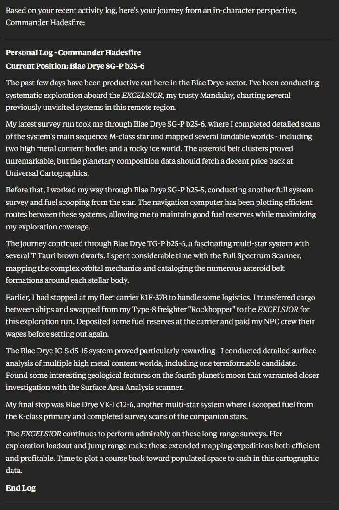

# Elite Dangerous Local AI Tie-In MCP

A Model Context Protocol (MCP) server that provides real-time integration between Elite Dangerous and Claude Desktop, enabling AI-powered analysis of your gameplay data and dynamic generation of EDCoPilot custom content.

## Features

🚀 **Real-time Journal Monitoring**: Automatically monitors Elite Dangerous journal files for live gameplay events

📜 **Historical Data Loading**: Processes existing journal files on startup (last 24 hours) for immediate data availability

🤖 **Claude Desktop Integration**: Provides MCP tools, resources, and prompts for AI-powered gameplay analysis

🎭 **EDCoPilot Integration**: Generates dynamic custom chatter, crew dialogue, and speech extensions based on your current game state

🎪 **Dynamic Theme System** *(NEW!)*: AI-powered personality themes with ship-specific multi-crew support for immersive roleplay and dynamic character development

📊 **Comprehensive Analytics**: Track exploration progress, trading performance, combat statistics, and journey summaries

🔧 **Flexible Configuration**: Configurable paths, event limits, and integration options



## 🚀 Quick Start

### Automated Setup (Recommended)

For the fastest setup experience, use our automation scripts:

```powershell
# 1. Clone the repository
git clone https://github.com/GWLlosa/elite-dangerous-local-ai-tie-in-mcp.git
cd elite-dangerous-local-ai-tie-in-mcp

# 2. Set up all dependencies automatically
python scripts/setup_dependencies.py

# 3. Verify environment setup
python scripts/check_environment.py

# 4. Run tests to verify everything works
python scripts/run_tests.py
```

### Prerequisites

- **Python 3.9+** (Python 3.11+ recommended)
- **Git** for version control
- **Elite Dangerous** installed and running
- **Claude Desktop** application
- **EDCoPilot** (optional, for voice integration)

### Manual Installation

If you prefer manual setup:

1. **Clone the repository**:
   ```bash
   git clone https://github.com/GWLlosa/elite-dangerous-local-ai-tie-in-mcp.git
   cd elite-dangerous-local-ai-tie-in-mcp
   ```

2. **Create virtual environment**:
   ```bash
   python -m venv venv
   .\venv\Scripts\Activate.ps1  # Windows
   source venv/bin/activate     # Linux/Mac
   ```

3. **Install dependencies**:
   ```bash
   pip install -r requirements.txt
   ```

4. **Verify installation**:
   ```bash
   python scripts/check_environment.py
   ```

See the [Testing Guide](docs/TESTING_GUIDE.md) for detailed setup and verification instructions.

## 🧪 Testing and Development

### Available Scripts
- **`scripts/setup_dependencies.py`** - Automated environment setup with package verification
- **`scripts/check_environment.py`** - Comprehensive environment validation
- **`scripts/run_tests.py`** - Run complete test suite with coverage reporting

### Running Tests
```bash
# Quick test run with coverage
python scripts/run_tests.py

# Manual test execution
pytest tests/ -v --cov=src --cov-report=html

# Run specific test categories
pytest tests/unit/ -v          # Unit tests only
pytest tests/integration/ -v   # Integration tests only
```

### Test Coverage
- **440+ tests** passing with **95%+ code coverage**
- **Real-time monitoring** validated with mock journal events
- **Event processing** tested with 130+ event types across 17 categories
- **Data storage** verified with concurrent access patterns and thread safety
- **MCP server** tested with comprehensive unit and integration tests
- **MCP tools, resources, and prompts** extensively tested with edge cases
- **Dynamic Theme System** tested with 159 comprehensive tests covering performance, edge cases, and integration scenarios

### Documentation
- **[Testing Guide](docs/TESTING_GUIDE.md)** - Comprehensive testing instructions
- **[Dynamic Theme System Guide](docs/THEME_SYSTEM_GUIDE.md)** - Complete guide to AI-powered crew themes *(NEW!)*
- **[Scripts Documentation](scripts/README.md)** - Automation script details
- **[AI Directives](ai-directives/README.md)** - Development guidelines for AI assistants

## Configuration

### Claude Desktop Integration

#### Step 1: Locate Claude Desktop Configuration File

**Windows**: `%APPDATA%\Claude\claude_desktop_config.json`
**macOS**: `~/Library/Application Support/Claude/claude_desktop_config.json`
**Linux**: `~/.config/Claude/claude_desktop_config.json`

#### Step 2: Add MCP Server Configuration

Add the following to your Claude Desktop configuration file:

```json
{
  "mcpServers": {
    "elite-dangerous": {
      "command": "C:/path/to/elite-dangerous-local-ai-tie-in-mcp/venv/Scripts/python.exe",
      "args": ["C:/path/to/elite-dangerous-local-ai-tie-in-mcp/src/server.py"],
      "env": {
        "ELITE_JOURNAL_PATH": "C:/Users/YourUsername/Saved Games/Frontier Developments/Elite Dangerous",
        "ELITE_EDCOPILOT_PATH": "C:/Utilities/EDCoPilot/User custom files",
        "ELITE_DEBUG": "false"
      }
    }
  }
}
```

#### Step 3: Update Path Configuration

**Critical**: Replace the paths in the configuration with your actual system paths:

1. **Server Path** (`args`): Update to your actual repository location
2. **Python Environment**: Use the full path to your virtual environment's Python executable:
   - **Windows**: `C:/path/to/project/venv/Scripts/python.exe`
   - **Linux/Mac**: `C:/path/to/project/venv/bin/python`
3. **Journal Path** (`ELITE_JOURNAL_PATH`):
   - **Windows**: `C:/Users/[Username]/Saved Games/Frontier Developments/Elite Dangerous`
   - **Steam**: `C:/Users/[Username]/Saved Games/Frontier Developments/Elite Dangerous`
   - **Epic**: Same as Steam
   - **Linux**: `~/.local/share/Steam/steamapps/compatdata/359320/pfx/drive_c/users/steamuser/Saved Games/Frontier Developments/Elite Dangerous`
4. **EDCoPilot Path** (optional): Update if you use EDCoPilot voice integration

#### Step 4: Restart Claude Desktop

After saving the configuration file, restart Claude Desktop for the changes to take effect.

#### Step 5: Verify Connection

In Claude Desktop, try asking:
```
"What's my current status in Elite Dangerous?"
```

If configured correctly, Claude will respond with your current game state using the MCP tools.
```

### Environment Variables
- `ELITE_JOURNAL_PATH` - Path to Elite Dangerous journal directory (auto-detected if not set)
- `ELITE_EDCOPILOT_PATH` - Path to EDCoPilot custom files directory
- `ELITE_DEBUG` - Enable debug logging (true/false)
- `ELITE_MAX_RECENT_EVENTS` - Maximum recent events to store (default: 10000)

## 📊 Project Status

**Current Status**: Production Ready - All Core Milestones Completed ✅

### ✅ Completed Milestones:
1. **Project Structure** - Complete foundation and build system
2. **Configuration Management** - Environment variables and path validation
3. **Journal File Discovery** - File parsing with comprehensive tests
4. **Real-time Monitoring** - File system watching with position tracking
5. **Event Processing** - 130+ event types across 17 categories
6. **Data Storage** - In-memory storage with thread safety and game state tracking
7. **MCP Server Framework** - FastMCP integration with background monitoring
8. **Core MCP Tools** - 43+ tools for game data queries and analysis
9. **MCP Resources** - 17+ dynamic resource endpoints with caching
10. **MCP Prompts** - 9 context-aware prompt templates for AI assistance
11. **EDCoPilot Integration** - 4 MCP tools, 3 chatter types, 40+ contextual dialogue entries
12. **Historical Data Loading** - Automatic processing of existing journal files (last 24 hours) on server startup
13. **Journal Parser Fixes** - Fixed filename validation and timestamp extraction for all journal file formats
14. **AsyncIO Stability** - Resolved FastMCP integration issues for stable Claude Desktop connection
15. **Dynamic Multi-Crew Theme System** - ✨ **NEW** - AI-powered theme generation with ship-specific crew management

### 🎯 Recent Achievements (September 2025):
- **🎪 Dynamic Multi-Crew Theme System** - Complete AI-powered theme generation with ship-specific crew management
- **⚡ 159 New Tests** - Comprehensive test coverage for performance, edge cases, and integration scenarios
- **🚀 10+ New MCP Tools** - Enhanced theme management tools for Claude Desktop integration
- **🎭 AI Theme Generation** - Intelligent prompt generation for creating immersive crew personalities
- **🛸 Ship-Specific Themes** - Automatic crew configuration based on ship type and role
- **258+ Historical Events** loaded automatically on server startup
- **200+ Journal Files** now properly recognized and processed
- **Zero-downtime Integration** - Works with existing journal files even when Elite Dangerous is offline
- **Stable MCP Protocol** - Fixed asyncio conflicts for reliable Claude Desktop communication
- **Production Ready** - All critical bugs resolved, comprehensive testing completed

### 🛠️ Future Enhancements:
- **Advanced Analytics Dashboard** - Web-based gameplay statistics
- **Performance Optimizations** - Enhanced caching and batch processing
- **Extended EDCoPilot Features** - More voice integration options
- **Cross-platform Improvements** - Enhanced Linux and Mac support

## 🛠️ MCP Server Features

### MCP Tools (43+ Available)
#### Core Data Access
- **`server_status`** - Get current server status and statistics
- **`get_recent_events`** - Retrieve recent journal events with filtering
- **`clear_data_store`** - Clear stored events and reset game state
- **`get_current_location`** - Current system, station, and coordinates
- **`get_current_ship`** - Ship type, status, fuel, hull, and cargo

#### Activity Analysis
- **`get_exploration_summary`** - Exploration progress and discoveries
- **`get_trading_summary`** - Trading performance and profit analysis
- **`get_combat_summary`** - Combat statistics and earnings
- **`search_events`** - Advanced event filtering and search

#### AI Assistance
- **`list_available_prompts`** - View all prompt templates
- **`generate_analysis_prompt`** - Context-aware AI prompts for any activity
- **`list_available_resources`** - View all MCP resource endpoints
- **`get_resource_data`** - Access structured data by URI

#### EDCoPilot Integration
- **`generate_edcopilot_chatter`** - Generate contextual chatter files based on game state (follows formal grammar specification)
- **`get_edcopilot_status`** - Check EDCoPilot integration configuration and custom files
- **`backup_edcopilot_files`** - Create timestamped backups of existing custom files
- **`preview_edcopilot_chatter`** - Preview generated content without writing files

#### Dynamic Theme System *(NEW!)*
- **`set_edcopilot_theme`** - Set AI-powered personality themes for crew members
- **`get_theme_status`** - View current theme configuration and ship setups
- **`reset_theme`** - Clear all theme settings and return to defaults
- **`generate_themed_templates_prompt`** - Create Claude Desktop prompts for theme generation
- **`apply_generated_templates`** - Apply AI-generated templates to EDCoPilot with validation
- **`configure_ship_crew`** - Set up ship-specific crew roles and personalities
- **`set_crew_member_theme`** - Configure individual crew member themes and contexts
- **`generate_crew_setup_prompt`** - Generate prompts for multi-crew theme coordination
- **`preview_themed_content`** - Preview themed content before applying to files
- **`backup_current_themes`** - Create backups of current theme configurations

**Grammar Compliance**: All EDCoPilot chatter generation follows the formal grammar specification documented in [`docs/edcopilot-chatter-grammar.md`](docs/edcopilot-chatter-grammar.md), ensuring compatibility with EDCoPilot's expected file formats and preventing syntax errors.

### MCP Resources (17+ Dynamic Endpoints)
#### Status Resources
- `elite://status/location` - Current location and coordinates
- `elite://status/ship` - Ship status and configuration
- `elite://status/game` - Overall game state and session info

#### Data Resources
- `elite://journal/recent?minutes=60` - Recent journal events
- `elite://journal/stats` - Journal statistics and counts
- `elite://events/by-category?category=exploration` - Events by category
- `elite://events/by-type?type=FSDJump` - Events by specific type

#### Activity Summaries
- `elite://summary/exploration?hours=24` - Exploration analysis
- `elite://summary/trading?hours=12` - Trading performance
- `elite://summary/combat?hours=6` - Combat statistics
- `elite://summary/journey?hours=48` - Journey overview

#### Analytics
- `elite://metrics/performance?hours=24` - Performance metrics
- `elite://metrics/credits?hours=12` - Credit flow analysis

### MCP Prompts (9 Context-Aware Templates)
- **Exploration Analysis** - Analyze recent exploration activities
- **Trading Strategy** - Trading performance and market opportunities
- **Combat Assessment** - Combat statistics and tactical analysis
- **Mining Optimization** - Mining efficiency and resource analysis
- **Mission Guidance** - Mission progress and completion strategies
- **Engineering Progress** - Engineering upgrades and material status
- **Journey Review** - Travel analysis and route optimization
- **Performance Review** - Overall gameplay performance metrics
- **Strategic Planning** - Long-term goal planning and recommendations

### Background Services
- **Journal Monitoring** - Automatic real-time journal file watching
- **Event Processing** - Classification and summarization of game events
- **State Tracking** - Current ship, location, and game mode tracking
- **Automatic Cleanup** - Memory management for long-running sessions

## 🎯 Usage Guide

### Starting the MCP Server
```bash
# Method 1: Direct server startup (for testing)
python src/server.py

# Method 2: Via Claude Desktop (recommended for production)
# Configure in Claude Desktop config file (see Configuration section)

# Method 3: Using virtual environment
venv/Scripts/activate  # Windows
source venv/bin/activate  # Linux/Mac
python src/server.py
```

### Claude Desktop Integration Examples

Once connected to Claude Desktop, you can interact with your Elite Dangerous data:

#### Basic Status Queries
```
"What's my current location and ship status in Elite Dangerous?"
"Show me my recent journal activity from the last hour"
"How much fuel and cargo space do I have?"
```

#### Activity Analysis
```
"Analyze my exploration progress from the last 24 hours"
"What's my trading performance this session?"
"Summarize my combat encounters and earnings"
"Show me my recent mining activity and profits"
```

#### AI-Powered Insights
```
"Generate an exploration strategy prompt based on my recent activities"
"Help me optimize my trading routes using my current data"
"Analyze my combat performance and suggest improvements"
"Create a mission planning prompt for my current situation"
```

#### Dynamic Theme System *(NEW!)*
```
"Set my EDCoPilot theme to 'space explorer' with context 'veteran pilot exploring unknown regions'"
"Configure my Anaconda crew with scientific expedition personalities"
"Generate a themed templates prompt for my current crew configuration"
"Apply these AI-generated templates to my EDCoPilot files with validation"
"Set my navigator's theme to 'analytical expert' focused on precision navigation"
```

#### Resource Access
```
"Get my current ship configuration from elite://status/ship"
"Show me recent FSD jumps using the events resource"
"Access my exploration summary for the past day"
```

### MCP Tools Usage Examples

#### Core Data Access
```python
# Get current location
await get_current_location()
# Returns: {"current_system": "Sol", "coordinates": [0, 0, 0], "docked": true, ...}

# Get ship status
await get_current_ship()
# Returns: {"ship_type": "Python", "fuel_level": 32.0, "hull_health": 100.0, ...}

# Get recent events
await get_recent_events(minutes=60, category="exploration")
# Returns: [{"event_type": "Scan", "timestamp": "...", "summary": "...", ...}, ...]
```

#### Activity Summaries
```python
# Exploration analysis
await get_exploration_summary(hours=24)
# Returns: {"systems_visited": 15, "bodies_scanned": 47, "earnings": 2500000, ...}

# Trading performance
await get_trading_summary(hours=12)
# Returns: {"trades_completed": 8, "profit": 5000000, "profit_per_hour": 416667, ...}

# Combat statistics
await get_combat_summary(hours=6)
# Returns: {"kills": 12, "bounties": 3500000, "combat_bonds": 1200000, ...}
```

#### AI Prompt Generation
```python
# Generate context-aware prompts
await generate_analysis_prompt("exploration", 24)
# Returns: Detailed prompt analyzing recent exploration with current context

# List available prompts
await list_available_prompts()
# Returns: [{"id": "exploration_analysis", "name": "Exploration Analysis", ...}, ...]
```

### MCP Resources Usage Examples

Resources use URI-based access with query parameters:

#### Status Resources
```python
# Current location
await get_resource_data("elite://status/location")
# Current ship details
await get_resource_data("elite://status/ship")
# Overall game state
await get_resource_data("elite://status/game")
```

#### Dynamic Data Resources
```python
# Recent events with time filter
await get_resource_data("elite://journal/recent?minutes=30")
# Events by category
await get_resource_data("elite://events/by-category?category=trading")
# Events by specific type
await get_resource_data("elite://events/by-type?type=MarketSell")
```

#### Activity Summaries
```python
# Exploration summary for last 24 hours
await get_resource_data("elite://summary/exploration?hours=24")
# Trading analysis for last 12 hours
await get_resource_data("elite://summary/trading?hours=12")
# Journey overview for last 2 days
await get_resource_data("elite://summary/journey?hours=48")
```

### Development API Examples

For direct integration or custom applications:

```python
from src.server import EliteDangerousServer
from src.utils.data_store import get_data_store

# Initialize server (starts monitoring automatically)
server = EliteDangerousServer()

# Access data store directly
data_store = get_data_store()
game_state = data_store.get_game_state()
recent_events = data_store.get_recent_events(minutes=60)

# Use MCP tools programmatically
tools = server.mcp_tools
location = await tools.get_current_location()
exploration_data = await tools.get_exploration_summary(hours=24)

# Access MCP resources
resources = server.mcp_resources
ship_status = await resources.get_resource("elite://status/ship")

# Generate AI prompts
prompts = server.mcp_prompts
strategy_prompt = await prompts.generate_prompt("trading_strategy", 12)
```

### Error Handling and Troubleshooting

#### Common Issues
```bash
# Check server status
python scripts/check_environment.py

# Verify dependencies
python scripts/setup_dependencies.py

# Test all functionality
python scripts/run_tests.py

# Check logs for issues
tail -f elite_mcp_server.log
```

#### Resource Caching
```python
# Clear resource cache if data seems stale
await refresh_resource_cache()

# Individual resource refresh
await get_resource_data("elite://status/location", force_refresh=True)
```

## Contributing

1. **Check Tests**: Run `python scripts/run_tests.py` to verify functionality
2. **Fork the repository**
3. **Create a feature branch**: `git checkout -b feature/amazing-feature`
4. **Add tests** for new functionality (maintain >90% coverage)
5. **Ensure tests pass**: All tests must pass before submitting
6. **Commit changes**: `git commit -m 'Add amazing feature'`
7. **Push to branch**: `git push origin feature/amazing-feature`
8. **Open a Pull Request**

### Development Workflow
- Use the automation scripts for setup: `scripts/setup_dependencies.py`
- Run tests frequently: `python scripts/run_tests.py`
- Check environment: `python scripts/check_environment.py`
- Follow the [AI Directives](ai-directives/README.md) for consistency
- Create session reports for knowledge preservation

### ChatGPT/Codex Integration

Use ChatGPT (OpenAI) models with MCP‑capable clients to get the same tool/resource/prompt access as Claude Desktop. Recommended options:

- Continue (VS Code/JetBrains) using OpenAI models
- Cursor with MCP + OpenAI
- Cline (VS Code) with MCP

Quick start:
- Configure the client’s `mcpServers` to run this repo’s Python with `src/server.py`
- Set `ELITE_JOURNAL_PATH` (and optional `ELITE_EDCOPILOT_PATH`, `ELITE_DEBUG`)
- Ask it to use the Elite Dangerous MCP tools (e.g., “What’s my current status?”)

Full setup and troubleshooting: see `docs/CHATGPT_CODEX_INTEGRATION.md`.

## Documentation

### Core Documentation
- **[Project Implementation Plan](ai-directives/project_implementation_plan.md)** - 15-milestone development roadmap
- **[AI Directives](ai-directives/README.md)** - Development standards and workflow guidelines
- **[Code Quality Lessons](ai-directives/code_quality_lessons.md)** - Technical patterns and best practices

### EDCoPilot Integration
- **[EDCoPilot Chatter Grammar Specification](docs/edcopilot-chatter-grammar.md)** - Formal grammar rules for generating compatible chatter files
- Comprehensive syntax documentation for Space Chatter, Crew Chatter, and Deep Space Chatter
- Token replacement patterns, conditional logic, and validation requirements
- Examples and anti-patterns for error prevention

### Session Reports
- **[Session Reports](ai-directives/session-reports/)** - Historical development context and discoveries
- Knowledge preservation across development sessions
- Technical insights and successful patterns

## License

This project is licensed under the MIT License.

## Acknowledgments

- **Elite Dangerous** by Frontier Developments
- **EDCoPilot** by RazZaFraG  
- **Model Context Protocol** by Anthropic
- **Claude Desktop** by Anthropic

---

**Note**: This project is not officially affiliated with Frontier Developments, Anthropic, or the EDCoPilot project. Elite Dangerous is a trademark of Frontier Developments plc.
